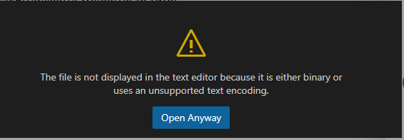
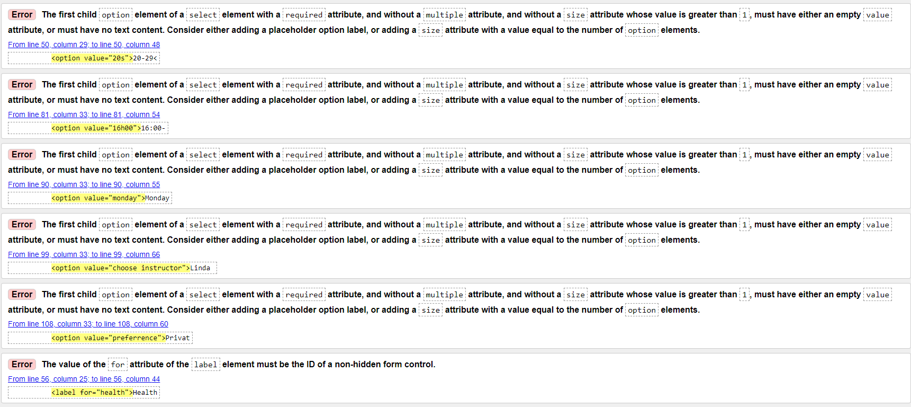

# Zola with Yoga!

*Zola with Yoga* is a site where you can relax, unwind and reset after a long day of work / school and feel refreshed for the next day. **Zola**, a word that derives from a South African language (Zulu) meaning *'calm'* or *'peacful'*, puts an emphasis on the energy the site will bring to the customers. What this site is hoping to accomplish is a more calm and joyful society. The target market is young and old adults, who wish to live a positive and stressless life.

## Features

#### Navigation Bar
- The navigation bar is set to make it easy for the user to get to the right page with just a click. 
- This section is found on all pages for the convinience of the user.

#### 

