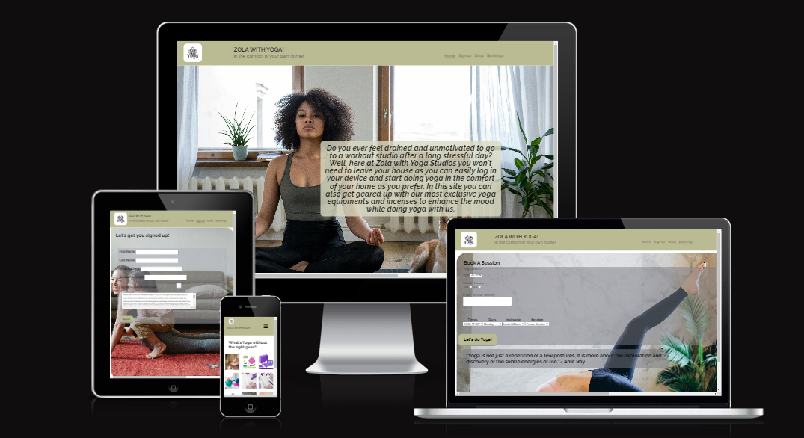
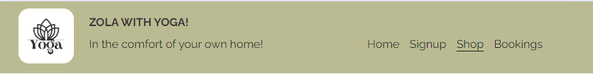
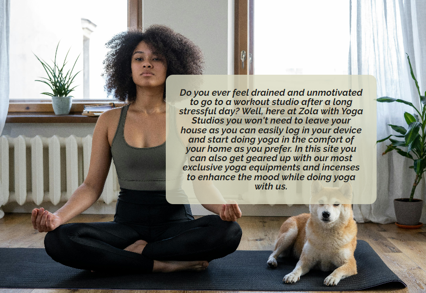
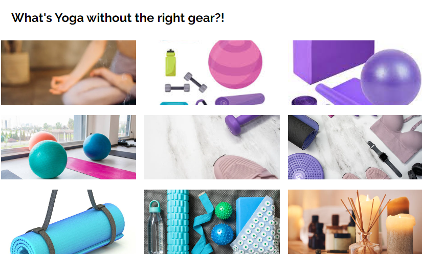
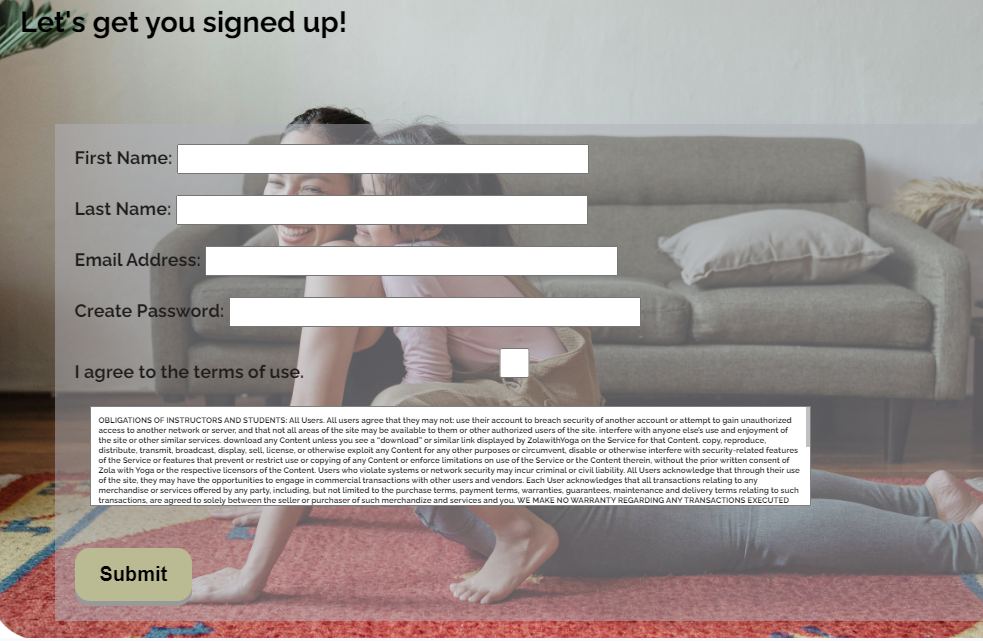
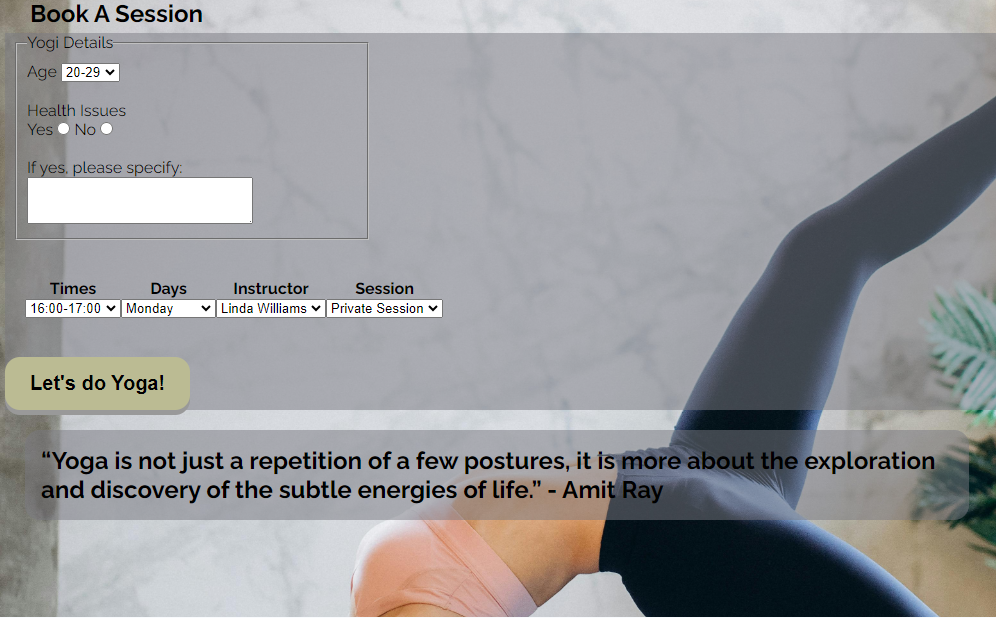
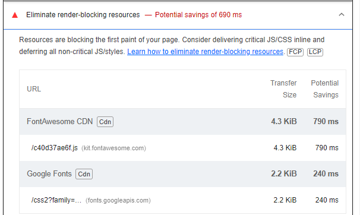
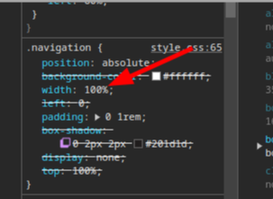
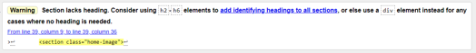
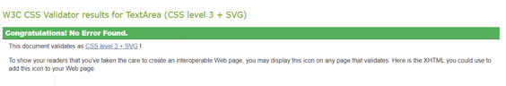

# Zola with Yoga!

*Zola with Yoga* is an online yoga studio where you can relax, unwind and reset after a long day of work / school and feel refreshed for the next day. **Zola**, a word that derives from a South African language (Zulu) meaning *'calm'* or *'peacful'*, puts an emphasis on the energy the site will bring to the customers. People are so busy in such a way that they no longer have time to go to fitness studios. This site hopes to help people interested in doing yoga but do not have time to travel to the actual studio. This site also hopes to accomplish a more calm and joyful society without having to pay more for transport. The target market is young and old adults, who wish to live a positive and stressless life. Customers who wish to keep fit but cannot afford to go to a studio.  Customers can also purchase Yoga equipment on the website's online shop. 

## Features

#### Navigation Bar
- The navigation bar is set to make it easy for the user to get to the right page with just a click. 
- This section is found on all pages for the convinience of the user. The user will not have to click on the back button to return to a page.

#### The Home page image
- The home page image is put as background image. The image shows a woman sitting in a position that shows she is doing yoga. She is located in her living room. Which illustrates the setting of the sessions.
- On top of the background image is a welcome message for users to have an idea of what exactly the site entails.
- The home page welcomes a user to the yoga studio which is held online. The user will be expected to read the welcome message then sign up for yoga if they are interested.

#### The Footer
- The footer shows the user the accessible social media platforms to visit in order to connect with us and to get more information about the site.
- On Instagram and Tiktok, that is where the users can have a glimpse of what the website contains with short videos of what takes place at each session. On WhatsApp that is where they can connect with us and ask questions.

#### The Shop page
- This page consists of a variety of products and equipments users can purchase so they are prepared for yoga.
- On this section, users do not have to be members in order to purchase the goods.

#### The Sign Up page
- This page has a form where customers can signup to become members of the studio.
- Once the form is completed, a submit button should be clicked. This button will take the user to a 'congratulations' page which shows the signup was successful.
- Terms of the website have been added so users are not blind sided when it comes to the product being sold.

#### The Bookings page
- This page consists of a fieldset which requires the age of the member as well as any information regarding their health. This is to help the instructor to prepare yoga moves which are suitable for the customer's age and health.  
- It also consists of the booking times as well as the preferred instructors and preferred settings.
- Our Studio has well trained and professional instructors who are more than willing to assist our customers to have the full experience as they wish. It contains of group and private sessions, where as in a private session it is just the customer and their chosen instructor.
- The customers may change instructors and preferred sessions as they please as the customer is the one that has to be happy at the end of every session.
- The instructors speak 4 different languages namely: English, Chinese, French and German.

### Features Left to Implement
* On the shop page - a style to view the prices of the goods being purchased.
* After signing up, a user should be taken to the bookings page.
* When a booking a session, customers should be able to choose a preferred language from the 4 spoken by the instructors.
* Once a member is done completing the bookings form, when they click the 'Let's do Yoga!' button, they should receive an email with Google Meet log in details.
* Add a phone number to connect to WhatsApp.

## Testing
My journey through creating this website was not an easy one. I had an idea of what I wanted however the results were not good. I even had to restart the whole website, and went through the lessons once again just so I can have a better understanding of the elements, attributes and so forth.  

The favicon gave me an issue as the files did not upload on my file explorer. I got an error

My results from Lighthouse show that less content should be used, and to reduce time spent parsing.

 

All images used on this project are set as background images, hence why the forms are blocking the women in the background. Just like any other background with content on top of it.

Desktop results look better than mobile results.

The navigation bar gave me problems a couple of times. I used this site: [Navigator](https://stackoverflow.com/questions/42095405/logo-and-navigation-bar-inline#:~:text=You%20could%20also%20simply%20put,align%20to%20center%20things%20horizontally.) However along the way it still didn't perform the way I had anticipated, especially the toggle section for small devices. I went throught the Love Running Walkthrough Project and found an easier way of doing it.

My project fits on all screens the way I had intended. Although at first it was an issue as there was unwanted space on the side. Sean, a Tutor from Code Insititute advised that the reason for the space is the navigation width which was set to 100% and positioned to left with another 70% which added the unwanted space. I then removed the width on larger devices as the effect was affecting only them. Now there is no space, the bakground images cover the whole screen.

### Validator Testing
* HTML
    - At the beginning I was struggling with adding the Favicon to html. It was impossible to upload Favicon files while I was doing the Love Running walkthrough project.
    - No errors were found.
    - A warning was found: Section lacks heading. A heading is supposed to be added on the section element or turn the section into a div rather [Validator W3 html](https://validator.w3.org/nu/#textarea)

    

* CSS
    - No errors were found [Validator W3 css](https://jigsaw.w3.org/css-validator/validator)
    
    

## Deployment
* This site was deployed to GitHub pages. The steps are as follows:
    - In the GitHub repository, navigate to the Settings tab
    - Under General section, select Pages
    - From the source section, click drop down to select Deploy from branch 
    - Under Branch, select main, file/root and save  
    - Once the save button is clicked, wait a couple of minutes to refresh the page
    - After refreshing, the code page will appear and show that deployemnt was successful.

The live link can be found here - https://hlomphosibeko.github.io/Zola-with-Yoga/

## Credits
### Content 
* The quote used on the bookings page is taken from this site: [Tegan by yoga]https://www.teganbyoga.com/post/best-yoga-quotes
* The terms and conditions used on the sign up page are taken from this site: [Terms and conditions](https://yogauonline.com/terms-and-conditions/)
* I struggled with getting my footer to stick to the bottom of the page, this site helped me: [Footer](https://www.w3schools.com/howto/tryit.asp?filename=tryhow_css_fixed_footer)
* The style for the submit button found on the sign up and bookings page was found in this site: [Signup W3School](https://www.w3schools.com/css/tryit.asp?filename=trycss_buttons_animate3)
* The position of which the images on the shop page are placed is found on this website: [Grid container](https://www.shecodes.io/athena/22284-how-to-scale-images-with-different-sizes-in-a-css-grid#:~:text=If%20your%20pictures%20have%20different,resized%20to%20fit%20its%20container.)

### Media
* The images used on this website are taken from various sites: [Yoga Images](https://www.pexels.com/search/yoga/) , [Yoga incense](https://www.pexels.com/search/incense/)
* The logo image used is taken from this site: [Yoga Logo](https://www.canva.com/design/play?type=TAB7AVEOUWQ&category=tACZCvjI6mE&locale=de-DE)
* Oisin, a Tutor from Code Institute provided a guide on how to compress images, which was found on this site: [TinyJPG](https://tinyjpg.com/)