# Zola with Yoga!

*Zola with Yoga* is an online yoga studio where you can relax, unwind and reset after a long day of work / school and feel refreshed for the next day. **Zola**, a word that derives from a South African language (Zulu) meaning *'calm'* or *'peacful'*, puts an emphasis on the energy the site will bring to the customers. People are so busy in such a way that they no longer have time to go to fitness studios. This site hopes to help people interested in doing yoga but do not have time to travel to the actual studio. This site also hopes to accomplish a more calm and joyful society without having to pay more for transport. The target market is young and old adults, who wish to live a positive and stressless life. Customers who wish to keep fit but cannot afford to go to a studio. Customers can also purchase Yoga equipment on the website's online shop. 

## Features

#### Navigation Bar
- The navigation bar is set to make it easy for the user to get to the right page with just a click. 
- This section is found on all pages for the convinience of the user. The user will not have to click on the back button to return to a page.
- When a user is on a certain page, there is a borderline below the name of the page which helps them see which page they are on at that time.
- By clicking the on the logo, a user can easily return to the home page.
- The slogan lets the user know that they can do yoga at their homes. Please see image below:

#### The Home page image
- The home page image is put as background image. The image shows a woman sitting in a position that shows she is doing yoga. She is located in her living room. Which illustrates the setting of the sessions.
- On top of the background image is a welcome message for users to have an idea of what exactly the site entails.
- The home page welcomes a user to the yoga studio which is held online. The user will be expected to read the welcome message then sign up for yoga if they are interested. Please see below image:

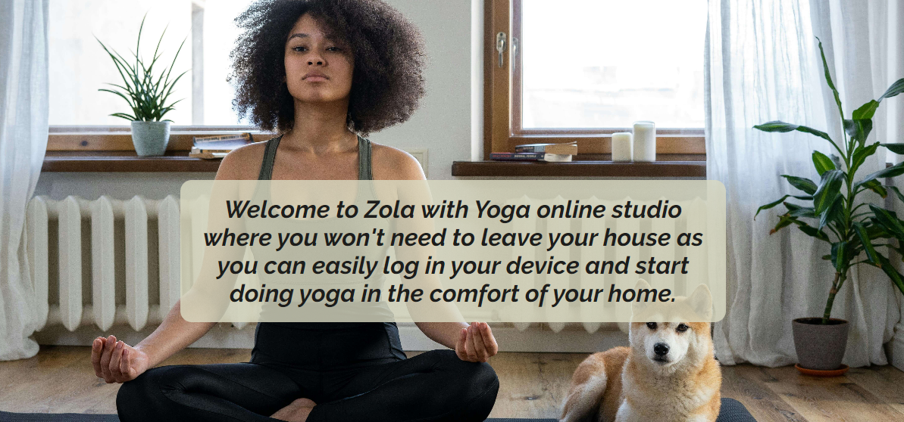

#### The Footer
- The footer shows the user the accessible social media platforms to visit in order to connect with us and to get more information about the site.
- On Instagram and Tiktok, that is where the users can have a glimpse of what the website contains with short videos of what takes place at each session. On WhatsApp that is where they can connect with us and ask questions. Please see image below:

#### The Shop page
- This page consists of a variety of products and equipments which users can purchase so they are prepared for yoga.
- On this section, users do not have to be members in order to purchase the goods. Please see image below:

#### The Sign Up page
- This page has a form where customers can signup to become members of the studio.
- Once the form is completed, a submit button should be clicked. This button will take the user to a 'congratulations' page which shows the signup was successful.
- Terms of the website have been added so users are not blind sided when it comes to the product being sold.
 

#### The Bookings page
- This page consists of a fieldset which requires the age of the member as well as any information regarding their health. This is to help the instructor to prepare yoga moves which are suitable for the customer's age and health. 
- It also consists of the booking times as well as the preferred instructors and preferred settings.
- Our Studio has well trained and professional instructors who are more than willing to assist our customers to have the full experience as they wish. It contains of group and private sessions, where as in a private session it is just the customer and their chosen instructor.
- The customers may change instructors and preferred sessions as they please as the customer is the one that has to be happy at the end of every session.
- The instructors speak 4 different languages namely: English, Chinese, French and German.

### Features Left to Implement
* On the shop page - a style to view the prices of the goods being purchased.
* After signing up, a user should be taken to the bookings page.
* When a booking a session, customers should be able to choose a preferred language from the 4 spoken by the instructors.
* Once a member is done completing the bookings form, when they click the 'Let's do Yoga!' button, they should receive an email with Google Meet log in details.
* Add a phone number to connect to WhatsApp.

## Testing
My journey through creating this website was not an easy one. I had an idea of what I wanted the website to look like, however the results were not good. I even had to restart the whole website, and went through the lessons once again just so I can have a better understanding of the elements, attributes and so forth.  

<!-- Favicon -->

##### My Favicon
The favicon gave me an issue as the files did not want to upload on my file explorer. The below screenshot would appear.

I then realised that the file name could be an issue as it would not allow the upload. I then renamed the file from "favicon-32x32" to "favicon-png.png", then it worked. On this section I used an emoji of a woman in Lotus Position which looks like a yoga position.

<!-- Home page not responding as background image -->

##### My Home Page
At first, I wanted the booking session table to be on the home page with a background image of a woman sitting in a lotus position, where a user can book sessions with the Yoga instructors. The table appeared to have a background image that was meant for the whole screen and the image below the table was not covering the whole screen. Through consultation with a tutor, I noticed that the image was being called on both CSS and HTML, hence why the home page had two images. See screen print below.

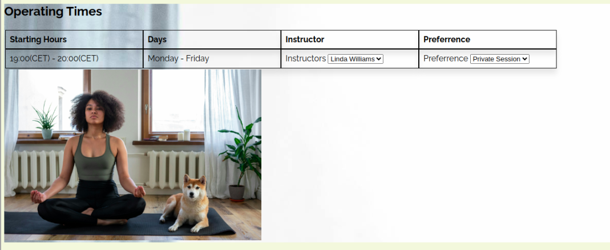

I then removed the image which was called on the html page and also decided to remove the table from the home page. Now the background image is covering the whole screen and includes a welcome message for the users. Please see the below screenshot.

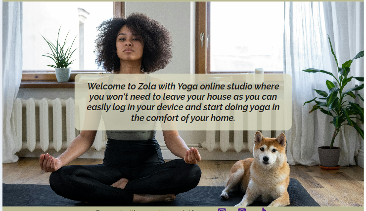

I had another issue of nesting the background image class and welcome message class in a div element. Which ever style I gave to the welcome message was affecting the background image. Please see result below.

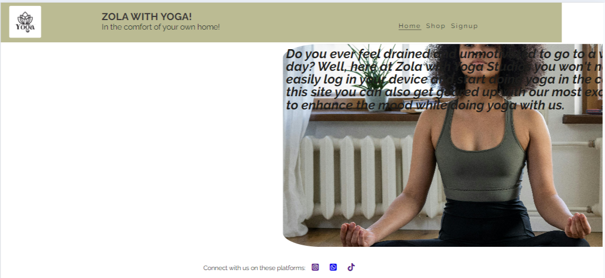

I seperated the classes in order to style them individually. I then applied the welcome message class to just the text. The below was the result.

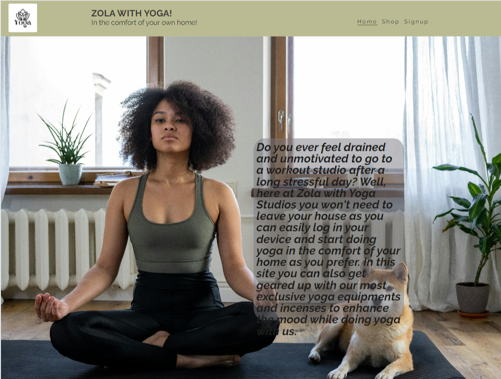

Withought a background color, editing the welcome message on different screen sizes was difficult, as the larger the screen, the less visible it would be. Please see screen below.

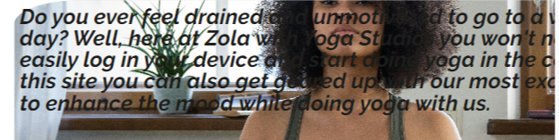

After research and consultation, I added a background-color and made it transparent for a better user experience. I had also added a height, which also made it difficult for the welcome message to fit. Please see screen below.

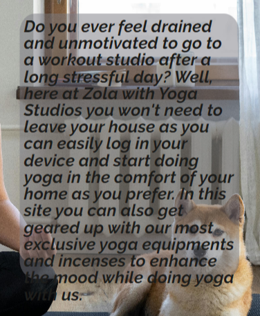
 
Seeing that adding a height on the welcome message made it difficult to edit, I removed it. This made the welcome message to fit perfectly inside the border and made it easy to edit for all screen sizes. Please see screenshot below.

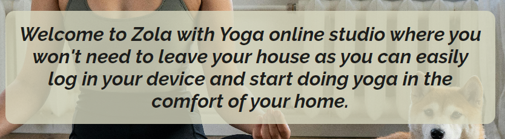

<!-- My shop pages images-->

##### My Shop Page
The below screen shows what the shop screen looked before I added the correct styling. The ugly spaces make the page look unappealing.

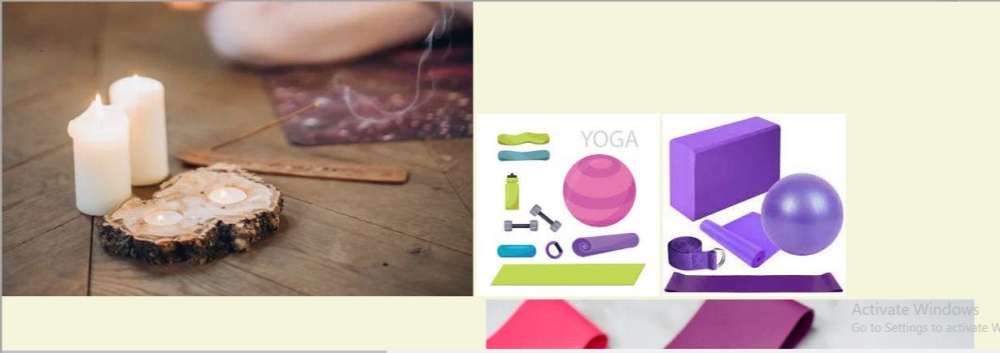

I had used grid to style the images, but they were not performing accordingly. By using the following site, I managed to beautify the images also the positioning: [CSS Grid](https://medium.com/@Kamran1819G/responsive-masonry-image-gallery-using-a-css-grid-1a1f2711eae7). The below screenshot shows what the page looks like now.

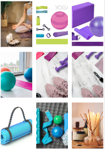

<!-- Forms on signup and bookings pages-->

##### My Signup Page

- A required feature is added on the form so all fields are completed in order for the the submit button to work.
- The submit button has a defensive feature that requires all fields to be completed. The below screenshot has a pop up error that requests the user to fill the required sections.

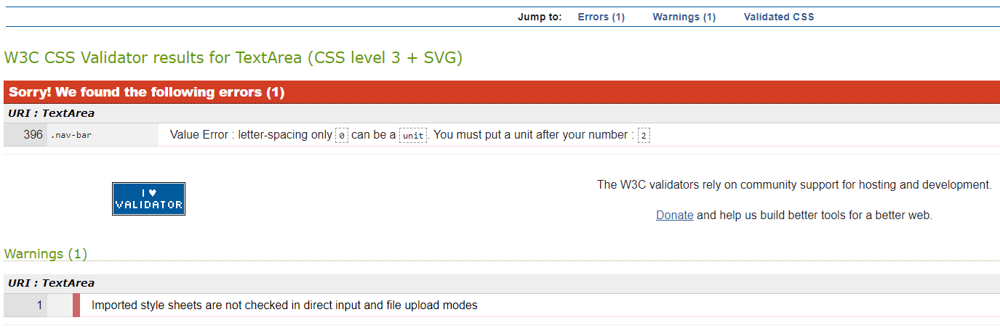

- When the email inserted does not have the correct symbols for an email, the below error will pop up. This is how the user will see that they have inserted something incorrectly.

- A checkbox should be checked once the terms and conditions have been read and understood by the user. Below is a screen shot of the terms.

- Once the form is completed, a submit button should be clicked. This button will take the user to a Code Institute 'congratulations' page which shows the signup was successful. Please see below screenshot: 

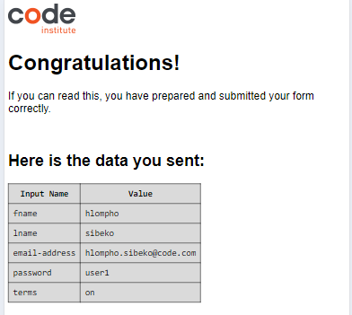

##### My Bookings Page 
The below screenshot shows the drop down where members would have to select their age group.

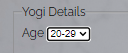

- The radio button forces a user to select one option, no multiple options can be selected at once. The below screenshot shows a selected answer to the health question. If the answer is yes, members would have to complete the below textarea to specify what the health issue is to help the instructor to prepare suitable exercises.

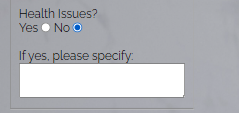

- A user cannot add instructors outside of the 5 names in the site. The user cannot add new time slots which are not on our scope. Below is the screenshot of the table where users can book their sessions.

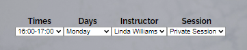

- The 'Let's do Yoga!' button has a defensive feature that requires all fields to be completed. Please see screen shot below.

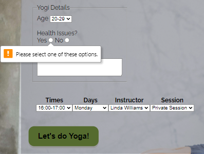

- When the 'Let's do yoga!' button is clicked, the user will be taken to another screen which shows that the member can start doing yoga.
- For now this button will take the user to a Code Institute 'congratulations' page which shows the signup was successful. Please see screenshot below.

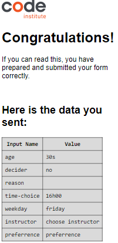
 

<!-- Navigation bar issues -->
##### My Navigation Bar
The navigation bar gave me problems a couple of times. The menu, slogan and logo could not be positioned inline for larger screens. Please see below screenshot. 

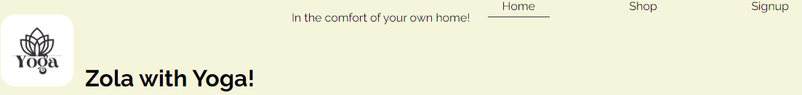

For small devices I wanted to use the toggle effect as shown on the Love Running Walkthrough Project. My toggle icon would not appear, instead the nav bar would go under the logo. On html, the width was set to 100% which was pushing the hamburger icon down. 

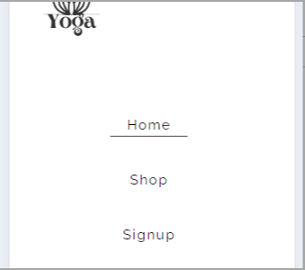 

I had wrapped the logo, nav-bar and toggle within an anchor which caused the menu not to drop down when burger icon is clicked. 

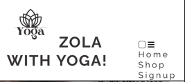

After research and consultation, I then removed the nav-bar and toggle html from the anchor. This resulted in the navigation bar menu to drop down when burger icon was clicked. The menu now appears below the navigation section when hamburger icon is clicked. The below screenshot shows the result.

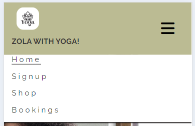

The navigation section looks great on larger devices as well. Please below screenshot below.

<!-- What website looks like on all devices -->
My project fits on all screens the way I had intended. Although at first it was an issue as there was unwanted space on the side. After consultating the tutors, I realised that the reason for the space is the navigation width which was set to 100% and positioned to left with another 70% which added the unwanted space. I then removed the width on larger devices as the effect was affecting only them. Please see below screen.

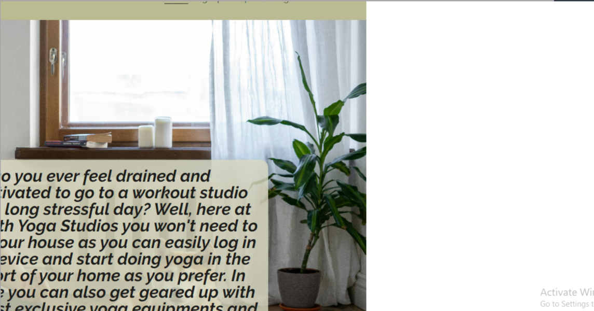

Now there is no space, the background images cover the whole screen.

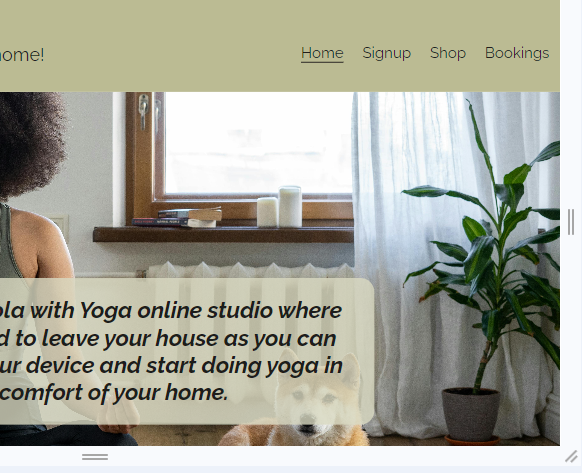

### Validator Testing

I had forgotten to validate my code at the beginning, but after so many changes to the codes, the below is my results:
* HTML
    - Errors were found on the bookings page:

    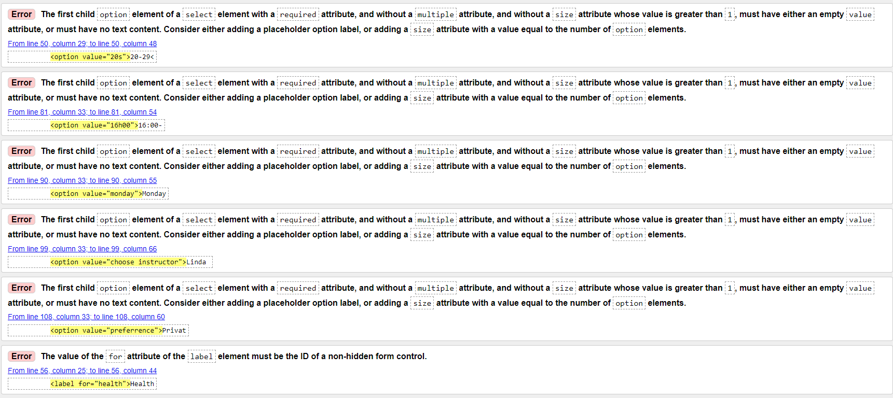

    - No errors were found.
    - A warning was found: Section lacks heading. A heading is supposed to be added on the section element or turn the section into a div rather [Validator W3 html](https://validator.w3.org/nu/#textarea)

    

* CSS
    - No errors were found [Validator W3 css](https://jigsaw.w3.org/css-validator/validator)
    
    

    - There was an error found on CSS with the nav-bar.
    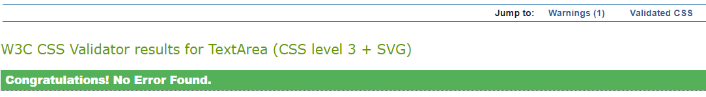

    

<!-- Lighthouse Results -->
* LIGHTHOUSE

All images used on this project are set as background images, hence why the forms are blocking the women in the background. Just like any other background with content on top of it.

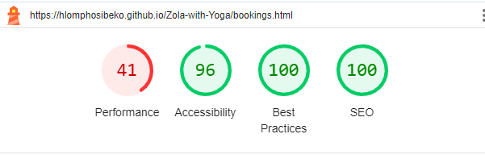 

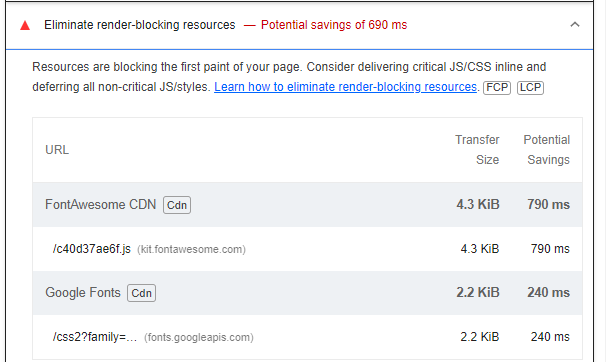

Desktop results look better than mobile results.

## Deployment
* This site was deployed to GitHub pages. The steps are as follows:
    - In the GitHub repository, navigate to the Settings tab
    - Under General section, select Pages
    - From the source section, click drop down to select Deploy from branch 
    - Under Branch, select main, file/root and save  
    - Once the save button is clicked, wait a couple of minutes to refresh the page
    - After refreshing, the code page will appear and show that deployemnt was successful.

The live link can be found here - https://hlomphosibeko.github.io/Zola-with-Yoga/

## Credits

### Content 
* The quote used on the bookings page is taken from this site: [Tegan by yoga]https://www.teganbyoga.com/post/best-yoga-quotes
* The terms and conditions used on the sign up page are taken from this site: [Terms and conditions](https://yogauonline.com/terms-and-conditions/)
* I struggled with getting my footer to stick to the bottom of the page, this site helped me: [Footer](https://www.w3schools.com/howto/tryit.asp?filename=tryhow_css_fixed_footer)
* The style for the submit button found on the sign up and bookings page was found in this site: [Signup W3School](https://www.w3schools.com/css/tryit.asp?filename=trycss_buttons_animate3)
* The position of which the images on the shop page are placed is found on this website: [Grid container](https://www.shecodes.io/athena/22284-how-to-scale-images-with-different-sizes-in-a-css-grid#:~:text=If%20your%20pictures%20have%20different,resized%20to%20fit%20its%20container.)
* Alan, a tutor at CI, assisted me with the Favicon.
* [Navigator](https://stackoverflow.com/questions/42095405/logo-and-navigation-bar-inline#:~:text=You%20could%20also%20simply%20put,align%20to%20center%20things%20horizontally.) 
* Roo, a tutor assisted with getting the shop page to have the grid look.
* Sean, a tutor assisted with removing the space on the side of the page which was caused by the width.
* Rebecca, a tutor helped me the issue with the background image that was applied on both CSS and HTML.
* Moritz, a mentor assisted with the transparent background color for the welcome message and the forms.

### Media
* The images used on this website are taken from various sites: [Yoga Images](https://www.pexels.com/search/yoga/) , [Yoga incense](https://www.pexels.com/search/incense/)
* The logo image used is taken from this site: [Yoga Logo](https://www.canva.com/design/play?type=TAB7AVEOUWQ&category=tACZCvjI6mE&locale=de-DE)
* Oisin, a Tutor from Code Institute provided a guide on how to compress images, which was found on this site: [TinyJPG](https://tinyjpg.com/)
* The favicon was found on this site: [Favicon](https://favicon.io/emoji-favicons/woman-in-lotus-position)